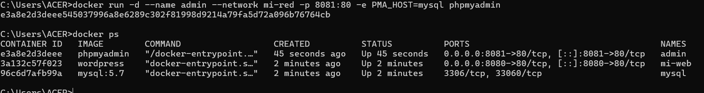
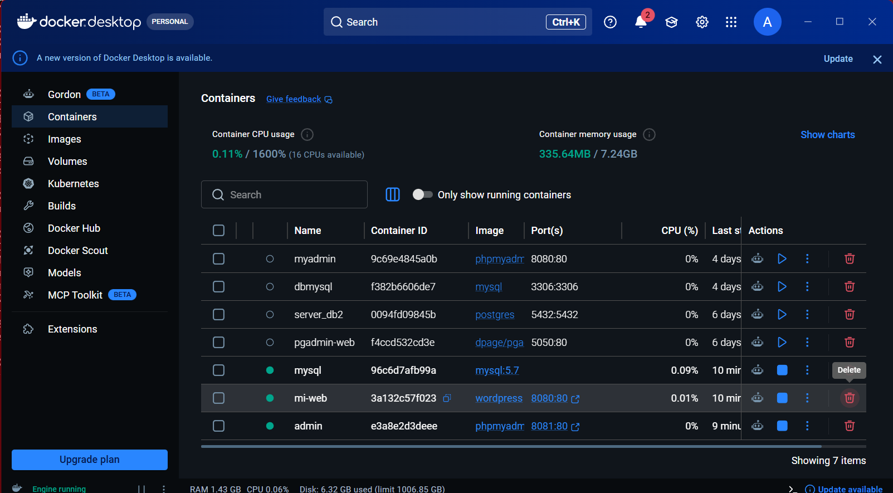
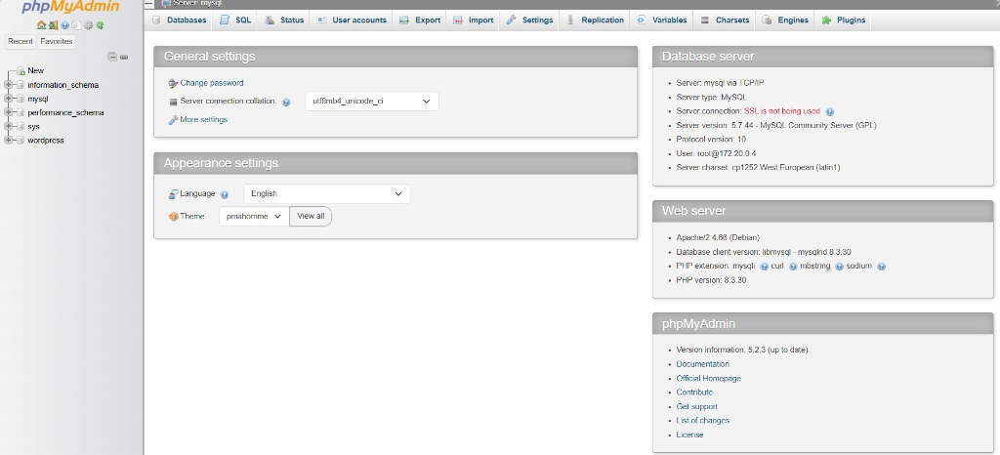
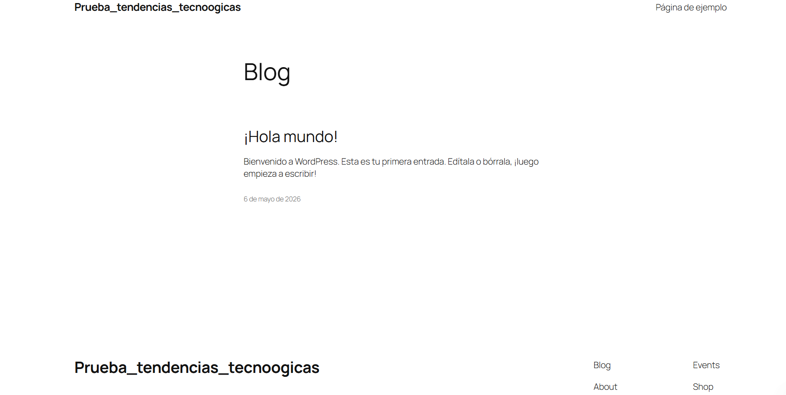

# Práctica: Despliegue de WordPress con Docker

**Estudiante:** Christian Andres Rojas  
**Carrera:** Tecnología en Desarrollo de Software  
**Asignatura:** Infraestructura y Tendencias Tecnológicas  
**Institución:** Instituto Sudamericano  
**Fecha:** Mayo 2026

---

## 1. Título

**Despliegue de un sitio WordPress mediante contenedores Docker: configuración de red, volúmenes y servicios interconectados.**

---

## 2. Tiempo de Duración

**90 minutos aproximadamente**, distribuidos de la siguiente manera:

- Creación de red y volúmenes: 10 min
- Despliegue y configuración de contenedores: 30 min
- Verificación de conectividad y resolución de errores: 25 min
- Documentación y capturas de evidencia: 25 min

---

## 3. Fundamentos

### ¿Qué es Docker?

Docker es una plataforma de código abierto que permite desarrollar, empaquetar y ejecutar aplicaciones dentro de **contenedores**. Un contenedor es una unidad de software que agrupa el código de una aplicación junto con todas sus dependencias (librerías, configuraciones, variables de entorno), garantizando que la aplicación se ejecute de manera idéntica en cualquier entorno, ya sea el equipo del desarrollador, un servidor de pruebas o producción.

A diferencia de las máquinas virtuales tradicionales, que virtualizan el hardware completo e incluyen su propio sistema operativo, los contenedores comparten el kernel del sistema operativo del host. Esto los hace significativamente más ligeros, rápidos de iniciar y eficientes en el uso de recursos (Turnbull, 2016).

### Contenedores vs. Máquinas Virtuales

Mientras que una máquina virtual puede tardar minutos en arrancar e incluye gigabytes de sistema operativo completo, un contenedor Docker arranca en segundos y ocupa únicamente el espacio de los archivos propios de la aplicación. Esta diferencia hace que Docker sea ideal para arquitecturas de microservicios, donde cada componente de una aplicación vive en su propio contenedor independiente.

### Redes en Docker

Docker permite crear **redes virtuales** para que los contenedores se comuniquen entre sí de forma segura y aislada. El tipo de red más común es **bridge**, que crea una red privada interna donde cada contenedor recibe un nombre de host propio. Esto significa que, en lugar de usar direcciones IP (que pueden cambiar), los contenedores se identifican por su nombre. Por ejemplo, el contenedor de WordPress puede conectarse a MySQL simplemente usando el nombre `mysql` como host (Docker Inc., 2024).

Esto también mejora la **seguridad**: un contenedor de base de datos puede existir dentro de la red interna sin exponer ningún puerto al exterior, haciéndolo inaccesible desde internet.

### Volúmenes en Docker

Por diseño, los contenedores son **efímeros**: cuando se detienen o eliminan, todos los datos generados dentro se pierden. Los **volúmenes** de Docker son el mecanismo para persistir datos más allá del ciclo de vida de un contenedor. Un volumen es una carpeta gestionada por Docker que existe en el sistema de archivos del host y se monta dentro del contenedor en la ruta especificada.

En esta práctica se utilizaron dos volúmenes:
- `db_data`: almacena los datos de la base de datos MySQL.
- `wp_data`: almacena los archivos del sitio WordPress.

### WordPress y su arquitectura

WordPress es el CMS (Content Management System) más utilizado del mundo, con más del 43% de los sitios web construidos sobre él (Wordpress.org, 2023). Su arquitectura requiere dos componentes principales: un **servidor web con PHP** (que ejecuta el código de WordPress) y una **base de datos MySQL** donde se almacenan los contenidos, usuarios y configuraciones. phpMyAdmin es una herramienta web que permite administrar la base de datos MySQL de forma visual, sin necesidad de usar la línea de comandos.

Desplegar WordPress en Docker implica levantar estos tres servicios como contenedores independientes y conectarlos correctamente mediante variables de entorno y una red compartida.

---

## 4. Conocimientos Previos

Para realizar esta práctica, el estudiante necesita tener claros los siguientes temas:

- Uso básico de la **línea de comandos** (CMD o PowerShell en Windows).
- Concepto de **puertos de red** y cómo funciona el mapeo de puertos en Docker.
- Qué es una **variable de entorno** y para qué se usa en una aplicación.
- Funcionamiento básico de un **navegador web** para acceder a los servicios.
- Conceptos generales de **bases de datos relacionales** (MySQL).
- Instalación y uso básico de **Docker Desktop**.

---

## 5. Objetivos a Alcanzar

- Crear una **red personalizada de Docker** tipo bridge para comunicar contenedores por nombre.
- Crear **volúmenes persistentes** para MySQL y WordPress que sobrevivan al reinicio de contenedores.
- Desplegar un contenedor de **MySQL 5.7** correctamente configurado con variables de entorno.
- Desplegar un contenedor de **phpMyAdmin** conectado a MySQL para su administración visual.
- Desplegar un contenedor de **WordPress** integrado con la base de datos y accesible desde el navegador.
- Verificar el correcto funcionamiento del stack completo mediante `docker ps` y acceso web.

---

## 6. Equipo Necesario

- Computador con sistema operativo **Windows 10/11** (64 bits) con virtualización habilitada en BIOS.
- **Docker Desktop** instalado y en ejecución (versión 4.x o superior).
- Navegador web moderno: **Chrome, Firefox o Edge**.
- Conexión a internet para descargar las imágenes de Docker Hub.
- Mínimo **4 GB de RAM disponible** para correr los tres contenedores simultáneamente.
- Terminal de comandos: **CMD o PowerShell**.

---

## 7. Material de Apoyo

- Documentación oficial de Docker: https://docs.docker.com
- Imagen oficial de WordPress en Docker Hub: https://hub.docker.com/_/wordpress
- Imagen oficial de MySQL en Docker Hub: https://hub.docker.com/_/mysql
- Imagen oficial de phpMyAdmin: https://hub.docker.com/_/phpmyadmin
- Guía de la asignatura — Infraestructura y Tendencias Tecnológicas, Instituto Sudamericano.
- Turnbull, J. (2016). *The Docker Book*. James Turnbull.

---

## 8. Procedimiento

### Paso 1: Crear la red interna de Docker

Se creó una red de tipo bridge llamada `mi-red`. Esta red permite que los contenedores se comuniquen entre sí usando su nombre como identificador, sin necesidad de conocer sus IPs.

```bash
docker network create mi-red
```

### Paso 2: Crear los volúmenes de datos

Se crearon dos volúmenes para garantizar que los datos persistan aunque los contenedores se detengan o eliminen.

```bash
docker volume create db_data
docker volume create wp_data
```

### Paso 3: Desplegar el contenedor de MySQL

Se instanció MySQL 5.7 con las credenciales necesarias. La variable `MYSQL_DATABASE` crea automáticamente la base de datos `wordpress` al primer arranque. El contenedor **no expone puertos al host** para mantenerlo seguro y solo accesible dentro de la red interna.

```bash
docker run -d \
  --name mysql \
  --network mi-red \
  -e MYSQL_ROOT_PASSWORD=rootpass \
  -e MYSQL_DATABASE=wordpress \
  -e MYSQL_USER=wpuser \
  -e MYSQL_PASSWORD=wppass \
  -v db_data:/var/lib/mysql \
  mysql:5.7
```

### Paso 4: Desplegar el contenedor de phpMyAdmin

Se levantó phpMyAdmin en el puerto local `8081`. La variable `PMA_HOST=mysql` le indica que busque el servidor de base de datos en el contenedor llamado `mysql` dentro de la misma red.

```bash
docker run -d \
  --name admin \
  --network mi-red \
  -p 8081:80 \
  -e PMA_HOST=mysql \
  phpmyadmin
```

### Paso 5: Desplegar el contenedor de WordPress

Se levantó WordPress en el puerto local `8080`. Las variables de entorno deben coincidir exactamente con las definidas en el contenedor de MySQL para que la conexión sea exitosa.

```bash
docker run -d \
  --name mi-web \
  --network mi-red \
  -p 8080:80 \
  -e WORDPRESS_DB_HOST=mysql:3306 \
  -e WORDPRESS_DB_USER=wpuser \
  -e WORDPRESS_DB_PASSWORD=wppass \
  -e WORDPRESS_DB_NAME=wordpress \
  -v wp_data:/var/www/html \
  wordpress
```

### Paso 6: Verificar que los contenedores están activos

Se ejecutó `docker ps` para confirmar que los tres contenedores están en estado **Up** con sus puertos correctamente mapeados.

```bash
docker ps
```

**Figura 1.** Salida del comando `docker ps` mostrando los tres contenedores activos.



### Paso 7: Verificación visual en Docker Desktop

Se abrió Docker Desktop para confirmar el estado del stack desde la interfaz gráfica, verificando que no hay conflictos de puertos y que el uso de recursos es estable.

**Figura 2.** Vista de Docker Desktop con los contenedores del stack en ejecución.



### Paso 8: Acceso a phpMyAdmin

Se accedió a `http://localhost:8081` en el navegador y se verificó la conexión exitosa con MySQL.

**Figura 3.** Panel de phpMyAdmin conectado al contenedor MySQL a través de la red `mi-red`.



### Paso 9: Acceso e instalación de WordPress

Se accedió a `http://localhost:8080`, se completó el asistente de instalación y se verificó que el sitio quedó operativo.

**Figura 4.** Sitio WordPress completamente desplegado y accesible en `localhost:8080`.



---

## 9. Resultados Esperados

Al finalizar la práctica se obtuvo un stack de tres servicios completamente funcional e interconectado:

- **MySQL 5.7** corriendo en la red interna `mi-red`, con la base de datos `wordpress` creada y datos persistidos en el volumen `db_data`. No expuesto al exterior.
- **phpMyAdmin** accesible en `http://localhost:8081`, conectado exitosamente a MySQL mediante resolución de nombre DNS interna. Permite administrar la base de datos visualmente.
- **WordPress** accesible en `http://localhost:8080`, completamente instalado y conectado a la base de datos. El sitio muestra la entrada por defecto "¡Hola mundo!", confirmando que la escritura en base de datos funciona correctamente.

El diagrama final de la arquitectura desplegada es el siguiente:

```
┌─────────────────────────────────────────────────────────────┐
│                     HOST — Windows                          │
│                                                             │
│  localhost:8080          localhost:8081                     │
│       │                       │                             │
│       ▼                       ▼                             │
│  ┌──────────┐          ┌────────────┐                       │
│  │  mi-web  │          │   admin    │                       │
│  │WordPress │          │ phpMyAdmin │                       │
│  │  :80     │          │    :80     │                       │
│  └────┬─────┘          └─────┬──────┘                      │
│       │                      │                             │
│       └──────────┬───────────┘                             │
│               mi-red (bridge)                              │
│                  │                                         │
│           ┌──────┴──────┐                                  │
│           │    mysql    │  ← puerto 3306, no expuesto      │
│           │  MySQL 5.7  │                                  │
│           └──────┬──────┘                                  │
│                  │                                         │
│  Volúmenes: db_data (/var/lib/mysql)                       │
│             wp_data (/var/www/html)                        │
└─────────────────────────────────────────────────────────────┘
```

| Contenedor | Imagen      | Puerto host → contenedor | Red    | Volumen |
|------------|-------------|--------------------------|--------|---------|
| `mi-web`   | wordpress   | 8080 → 80                | mi-red | wp_data |
| `admin`    | phpmyadmin  | 8081 → 80                | mi-red | —       |
| `mysql`    | mysql:5.7   | no expuesto → 3306       | mi-red | db_data |

---

## 10. Bibliografía

Docker Inc. (2024). *Docker overview*. Documentación oficial de Docker. https://docs.docker.com/get-started/overview/

Docker Inc. (2024). *Networking overview*. Documentación oficial de Docker. https://docs.docker.com/network/

Docker Inc. (2024). *Manage data in Docker*. Documentación oficial de Docker. https://docs.docker.com/storage/volumes/

Joyanes Aguilar, L. (2020). *Sistemas Operativos y Computación en la Nube*. McGraw-Hill Interamericana.

Turnbull, J. (2016). *The Docker Book: Containerization is the new virtualization*. James Turnbull.

WordPress.org. (2023). *WordPress market share statistics*. https://wordpress.org/about/stats/
